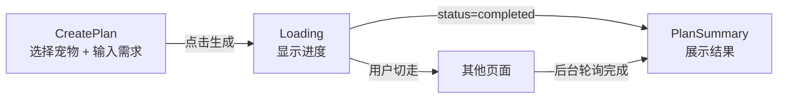
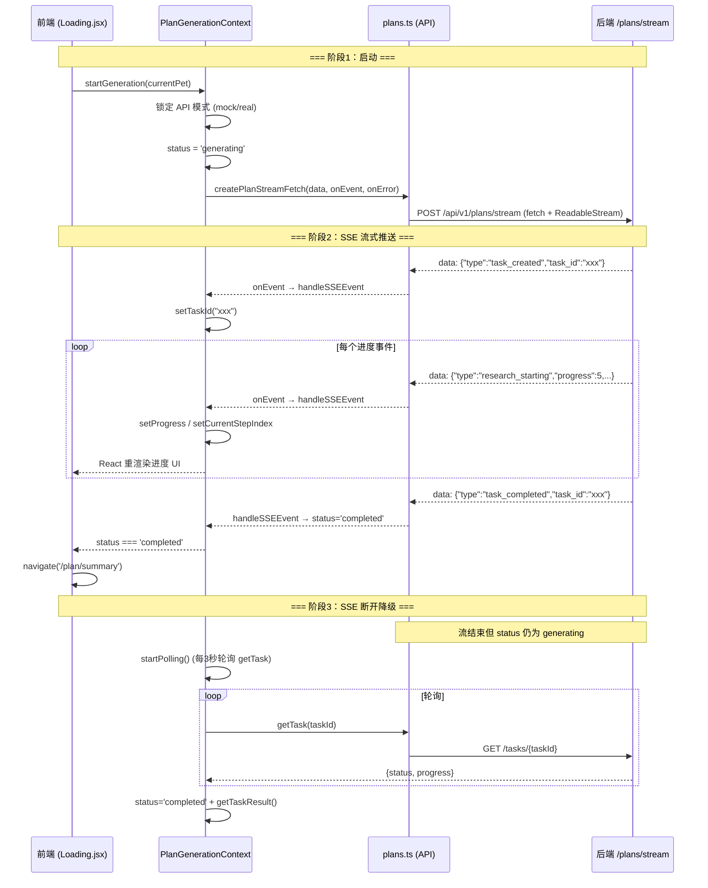
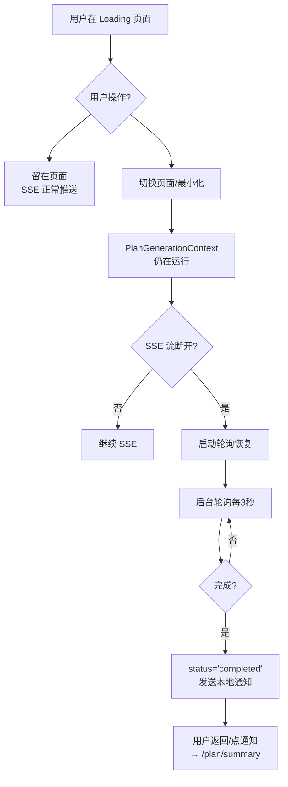

# 食谱定制流程分析与问题修复

## 一、前后端完整流程分析

### 1. 页面流转

| 步骤 | 页面 | 路由 | 说明 |
|------|------|------|------|
| 1 | CreatePlan | `/plan/create` | 选择宠物、输入需求、点击「生成专属计划」 |
| 2 | Loading | `/planning` | 显示生成进度，SSE 实时更新步骤 |
| 3 | PlanSummary | `/plan/summary` | 展示生成结果 |

---

### 2. 流式交互架构（SSE + 轮询降级）

---

### 3. 离开页面后重连机制

**关键机制：**

1. **Context 全局存在**：[PlanGenerationProvider](file:///e:/Graduate/frontend/web-app/src/context/PlanGenerationContext.jsx#22-517) 包裹在 [App](file:///e:/Graduate/frontend/web-app/src/App.jsx#121-134) 最外层，**不因页面切换而卸载**
2. **SSE 流在 Context 中管理**：即使用户从 Loading 页面导航离开，`startGeneration` 中的 fetch 仍在运行
3. **SSE 断开 → 轮询降级**：fetch 流结束后，如果 `status` 仍为 `generating` 且有 `taskId`，自动切换到 3 秒轮询
4. **移动端后台恢复**：Capacitor `appStateChange` 监听前后台切换，返回前台时调用 `restoreFromBackground()` 检查任务状态
5. **完成后发通知**：`sendCompletionNotification()` 发送本地通知，点击通知跳转 `/plan/summary`

---

## 二、问题定位

### 🐛 核心问题：[PlanSummary.jsx](file:///e:/Graduate/frontend/web-app/src/pages/PlanSummary.jsx) 完全是硬编码 Mock 数据

> [!CAUTION]
> [PlanSummary.jsx](file:///e:/Graduate/frontend/web-app/src/pages/PlanSummary.jsx) **没有使用** `PlanGenerationContext` 的 `result` 状态，所有内容（宠物名、营养数据、食谱）全部是写死的 JSX。

**具体表现：**

| 内容 | 当前实现 | 应有行为 |
|------|----------|----------|
| 宠物名 | 硬编码 "Cooper" | 应从 `result` 或 `currentPet` 读取 |
| 营养目标 | 硬编码 850kcal / 400ml | 应从后端返回的计划数据读取 |
| 食谱详情 | 硬编码 3 道菜 | 应渲染后端返回的每日食谱 |
| Agent 提示 | 硬编码 3 条建议 | 应展示后端生成的建议 |

**为什么 Loading 页面过一段时间就跳转到 mock 数据页面？**

这是**正常行为**——流程本身是对的：

1. 进入 Loading → `startGeneration()` 启动
2. Mock 模式下，SSE 事件序列约 20 秒播完
3. 收到 `task_completed` 事件 → `status='completed'`
4. Loading 的 `useEffect` 检测到 completed → `navigate('/plan/summary')`
5. **但** [PlanSummary.jsx](file:///e:/Graduate/frontend/web-app/src/pages/PlanSummary.jsx) 不读取任何真实数据 → 所以看到的全是硬编码内容

如果后端真实运行，流程也一样：完成后跳转，但页面仍然显示硬编码内容。

---

## 三、修复方案

### 目标

让 [PlanSummary.jsx](file:///e:/Graduate/frontend/web-app/src/pages/PlanSummary.jsx) 从 `PlanGenerationContext` 的 `result` 状态读取后端返回的真实数据进行渲染。

> [!IMPORTANT]
> 这个修复目前**依赖后端返回数据的格式**。需要确认后端 `task_completed` 事件或 [getTaskResult](file:///e:/Graduate/frontend/web-app/src/api/plans.ts#178-184) API 返回的数据结构。

### 当前 `result` 数据来源

`result` 值设置有两个路径：

1. **SSE 路径**：收到 `final_result` 事件时 → `setResult(data.data)`
2. **轮询路径**：轮询发现 completed 后 → [getTaskResult(taskId)](file:///e:/Graduate/frontend/web-app/src/api/plans.ts#178-184) → `setResult(resultRes.data)`

> [!WARNING]
> SSE 中的 `task_completed` 事件本身可能**不包含结果数据**（根据后端 SSE 文档，`task_completed` 包含 result 字段，但当前 Context 的 `handleSSEEvent` 仅在 `final_result` 类型时设置 result）。需要确认后端实际发送的事件序列。

### 需要用户确认

1. 后端 `task_completed` 事件是否在 `result` 字段中包含完整计划数据？还是需要额外通过 `GET /tasks/{taskId}/result` 获取？
2. 后端返回的计划数据具体 JSON 结构是什么？（mock 数据中有 `mockPlanResult` 可参考，但真实后端可能不同）

### 提出的修改

#### [MODIFY] [PlanSummary.jsx](file:///e:/Graduate/frontend/web-app/src/pages/PlanSummary.jsx)

将硬编码内容替换为从 [usePlanGeneration()](file:///e:/Graduate/frontend/web-app/src/context/PlanGenerationContext.jsx#14-21) 的 `result` 读取数据，动态渲染：
- 宠物名称、健康状况
- 每日营养目标
- 每日食谱详情
- Agent 建议

**如果 `result` 为空（用户直接访问该页面），应提供加载状态或提示返回。**

#### [MODIFY] [PlanGenerationContext.jsx](file:///e:/Graduate/frontend/web-app/src/context/PlanGenerationContext.jsx)

在 `task_completed` 事件处理中，确保也获取 result 数据（如果 SSE 事件自带 result 就直接设置，否则主动调用 [getTaskResult](file:///e:/Graduate/frontend/web-app/src/api/plans.ts#178-184)）。

---

## 四、验证计划

### 浏览器测试

1. 启动 dev server：`npm run dev`（已运行）
2. 从 CreatePlan 页面点击「生成专属计划」
3. 观察 Loading 页面进度是否正常推进
4. 完成后跳转到 PlanSummary，**确认显示的是后端/mock 返回的真实数据**而非硬编码内容
5. 验证数据字段（宠物名、营养值、食谱）与 mock 数据中的内容一致

### 手动验证（需用户协助）

如果后端可用，用户需要：
1. 启动后端服务
2. 确保 mock 模式关闭
3. 从头走一遍完整流程，确认真实后端数据正确渲染
